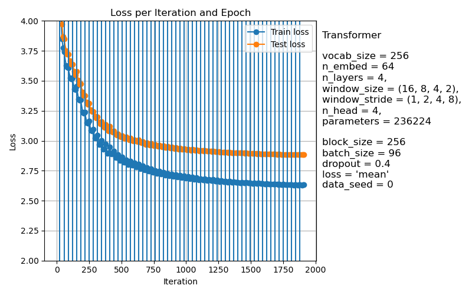

# Mini Transformer
Implementación básica desde cero de un transformer con las siguientes propiedades:
- Atención con ventana deslizante con _stride_ configurable e implementación eficiente.
- Soporte para embeddings rotatorios y relativos.
- Facilidad para configurar cada una de las capas del transformer.

A continuación se muestra el ejemplo de un transformer configurado con un tamaño de 
embedding de 64 con 4 capas. Cada capa va reduciendo su tamaño de ventana y aumentando
el stride, manteniendo el campo de visión efectivo.

```python
m = Transformer(
    vocab_size=len(sp),
    window_size=(16,8,4,2),
    window_stride=(1,2,4,8),
    n_embed=64,
    n_layers=4,
    n_head=4,
    encoding="relative",
    dropout=0.0
).to(device)
```



Ejemplos de URLS falsas generadas con el transformer entrenado desde cero en conversaciones
de WhatsApp.

```
https://www.instagram.com/r/watchs/el/c3855829480791918z253664089356rqryjdjm
https://www.youtube.com/watch?v=ymmymm2ylfjpngshid=xpr/elf-bitchthshare=share
https://twitter.com/winstagram/fix/vadr/x3chrby-puml9f56321x04f86hare=s70ey=yat
```
